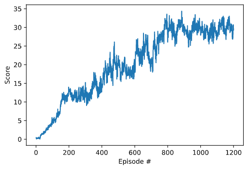

# Continuous Control - Reacher

Author: Ashvitha R Shetty

### Project details

Objective: Train a double-jointed arm agent to move to target locations. A reward of +0.1 is provided for each step that the agent's hand is in the goal location. Thus, the goal of your agent is to maintain its position at the target location for as many time steps as possible.

The observation space consists of 33 variables corresponding to position, rotation, velocity, and angular velocities of the arm. Each action is a vector with four numbers, corresponding to torque applicable to two joints. Every entry in the action vector should be a number between -1 and 1.

The task is episodic, and in order to solve the environment, your agent must get an average score of +30 over 100 consecutive episodes.

The environment is based on [Unity ML-agents](https://github.com/Unity-Technologies/ml-agents). The Unity Machine Learning Agents Toolkit (ML-Agents) is an open-source Unity plugin that enables games and simulations to serve as environments for training intelligent agents.


### Algorithm

I  have implemented Deep Deterministic Policy Gradient (DDPG) in a parallel environment setting (20 agents). Deep Deterministic Policy Gradient (DDPG) is a model-free off-policy algorithm for learning continous actions. It combines ideas from DPG (Deterministic Policy Gradient) and DQN (Deep Q-Network). It uses Experience Replay and slow-learning target networks from DQN, and it is based on DPG, which can operate over continuous action spaces.

Sources:
- [Deep Deterministic Policy Gradient](https://keras.io/examples/rl/ddpg_pendulum/)
- [Continuous Control With Deep Reinforcement Learning](https://arxiv.org/abs/1509.02971)


### Network Architecture

- There are a total of four networks: local and target actor networks, and local and target critic networks.
- The actor's networks consists of 3 fully connected layers. The critic's networks consist of 4 fully connected layers.
- For actors, there are 33 (states), 256, 128 and 4 (actions) neurons in each layer respectively.
- For critics, there are 37 (states + actions), 256, 128, 128 and 1 (Q value) neurons in each layer respectively.
- The actor network takes the state as input and gives an action as output.
- The critic network takes the combination of state and action as input and gives the Q value as output.


### Hyperparameters

```
BUFFER_SIZE = int(1e6)  # replay buffer size
BATCH_SIZE = 512        # minibatch size
GAMMA = 0.99            # discount factor
TAU = 1e-3              # for soft update of target parameters
LR_ACTOR = 1e-4         # learning rate of the actor
LR_CRITIC = 1e-4        # learning rate of the critic
WEIGHT_DECAY = 0.0001   # L2 weight decay
```

### Results

The environment was solved in 1200 episodes with an average reward of 30.001 over 100 consecutive episodes. The graph below shows the reward received in each episode.



### Future Ideas

- Explore algorithms such as PPO and TRPO to train the agent and compare the results.
- Use prioritized replay buffer to give importance to rare events during random sampling of events.
